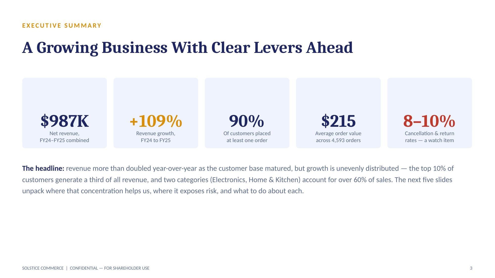
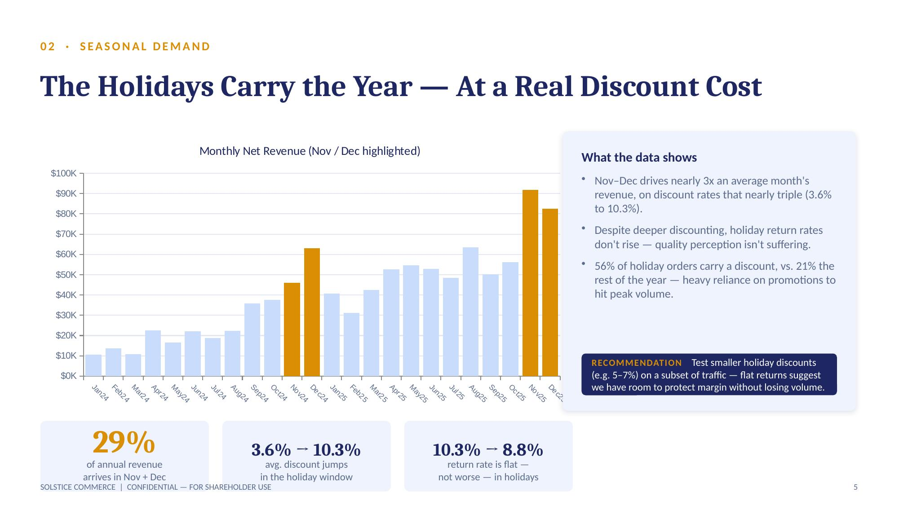

# E-Commerce Analytics: From Raw Data to Shareholder-Ready Insights

An end-to-end analytics project simulating how a data analyst would support a product/leadership team at an e-commerce company — from designing the underlying data, to writing the SQL that answers real business questions, to presenting findings to stakeholders.

> **Note on the data:** The dataset is synthetically generated (not scraped or sourced from a real company), built to mimic realistic e-commerce patterns — seasonality, repeat-customer behavior, correlated pricing, and intentional missing/messy values — so the cleaning and analysis steps reflect real-world conditions. Full generation logic is in [`scripts/generate_data.py`](ecommerce-analytics-project/scripts/generate_data.py). 

## Why this project

Most portfolio SQL projects stop at "here are some queries." This one goes further: it starts from a business question, not a table — then designs the data, cleans it, analyzes it, and ends with an executive-ready deliverable. The goal was to practice the full loop a data analyst is actually hired to run.

## Business questions answered

1. **Customer Lifecycle & Retention** — Are customers still engaged after they sign up, and does engagement decay with tenure?
2. **Seasonal Demand & Promotions** — What drives the holiday revenue spike, and at what cost in discounting?
3. **Category Performance** — Which product categories create the most durable (not just highest) value?
4. **Fulfillment & Payment Experience** — Do shipping or payment methods correlate with cancellations/returns?
5. **Customer Concentration & Acquisition** — How concentrated is revenue among top customers, and which acquisition channels convert best?

## Key findings

- Revenue grew **+109% year-over-year** as the customer base matured, but **the top 10% of customers generate 34% of total revenue** — growth is concentrated, not evenly distributed.
- **November–December drives ~29% of annual revenue**, but the average discount nearly triples (3.6% → 10.3%) to get there — while the return rate stays flat, suggesting room to test smaller holiday discounts without hurting volume.
- **Electronics is 16% of orders but 47% of revenue** — the highest value-per-order category by a wide margin.
- Cancellation and return rates are **flat across every shipping and payment method** (7–11%) — ruling out fulfillment/checkout friction as a root cause, and pointing instead toward product-level issues in categories like Toys & Games (16.0% return rate).
- **Paid Social and Referral signups convert to a first order 8–9 points lower** than Organic Search and Email — a likely candidate for reallocating acquisition budget.

Full narrative, charts, and recommendations: [`presentation/solstice_commerce_shareholder_review.pptx`](ecommerce-analytics-project/presentation/solstice_commerce_shareholder_review.pptx)

<p align="center">
  
  
</p>

## Repo structure

```
ecommerce-analytics-project/
├── data/
│   ├── customers.csv              # 1,000 customers (~100 with zero orders)
│   └── orders.csv                 # 5,000 orders, 2-year span
├── scripts/
│   └── generate_data.py           # Synthetic data generation (seasonality, missingness, correlations)
├── sql/
│   └── ecommerce_analysis.sql     # Cleaning views + 5 business-question queries
├── presentation/
│   ├── solstice_commerce_shareholder_review.pptx
│   └── screenshots/                # Slide previews for this README
└── README.md
```

## Data model

Two tables, joined on `customer_id`:

| Table | Grain | Key columns |
|---|---|---|
| `customers` | 1 row per customer | `customer_id` (PK), signup_date, loyalty_tier, acquisition_channel, demographics |
| `orders` | 1 row per order | `order_id` (PK), `customer_id` (FK), order_date, category/product, pricing, status, fulfillment |

Deliberate realism built into the data:
- Seasonal ordering patterns (Black Friday/holiday spike, post-holiday dip)
- Long-tail repeat-purchase distribution (most customers order 1–4 times; a VIP segment orders up to 29 times)
- ~100 customers with zero orders (simulating inactive signups)
- Internally consistent financials (`subtotal`, `shipping_cost`, `tax_amount`, `total_amount` always reconcile)
- Intentional missing values in realistic places (age, gender, payment method, ratings)

## Tech stack

- **Python** (pandas, numpy) — synthetic data generation
- **SQL** (PostgreSQL syntax) — data cleaning views, CTEs, window functions (`RANK`, `NTILE`), cohort analysis
- **PowerPoint / pptxgenjs** — stakeholder-facing presentation

## How to reproduce

```bash
# 1. Generate the datasets
pip install pandas numpy
python scripts/generate_data.py

# 2. Load into your database of choice, e.g. PostgreSQL
psql -d your_db -c "\copy customers FROM 'data/customers.csv' CSV HEADER"
psql -d your_db -c "\copy orders FROM 'data/orders.csv' CSV HEADER"

# 3. Run the analysis
psql -d your_db -f sql/ecommerce_analysis.sql
```

## Limitations

- Data is synthetic — great for practicing clean end-to-end analysis, but it won't contain the truly unpredictable noise of a real production system.
- Retention/cohort curves reflect the generation logic (orders distributed across the full date range per customer) rather than a modeled churn process — the README and presentation call this out rather than overstating a "decay" story the data doesn't actually show.

## Author

Jaideep Kumar — built as a portfolio project to practice SQL, data modeling, and business-facing analytics communication.
[[LinkedIn](https://www.linkedin.com/in/jaideep-kumar69/) · [[Portfolio](https://jaideepkumar.site/)
